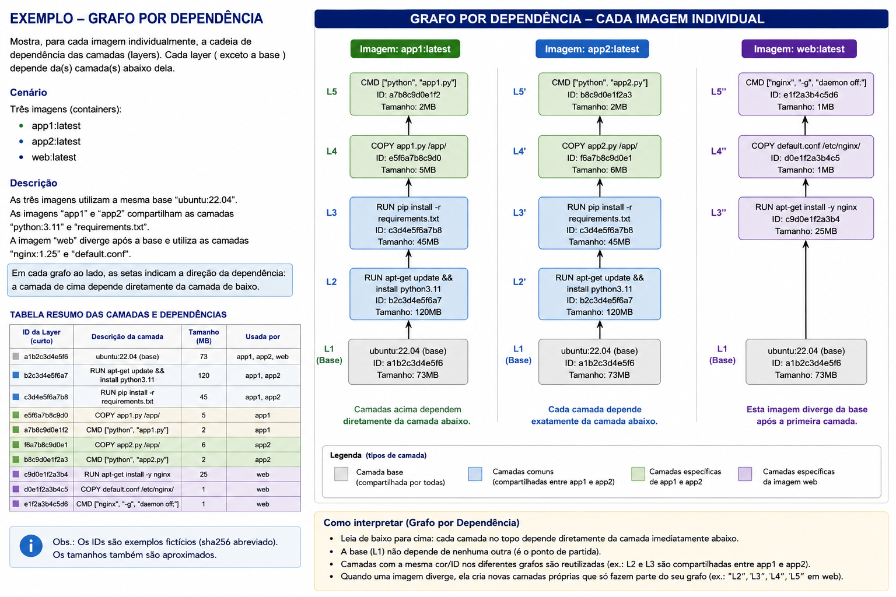
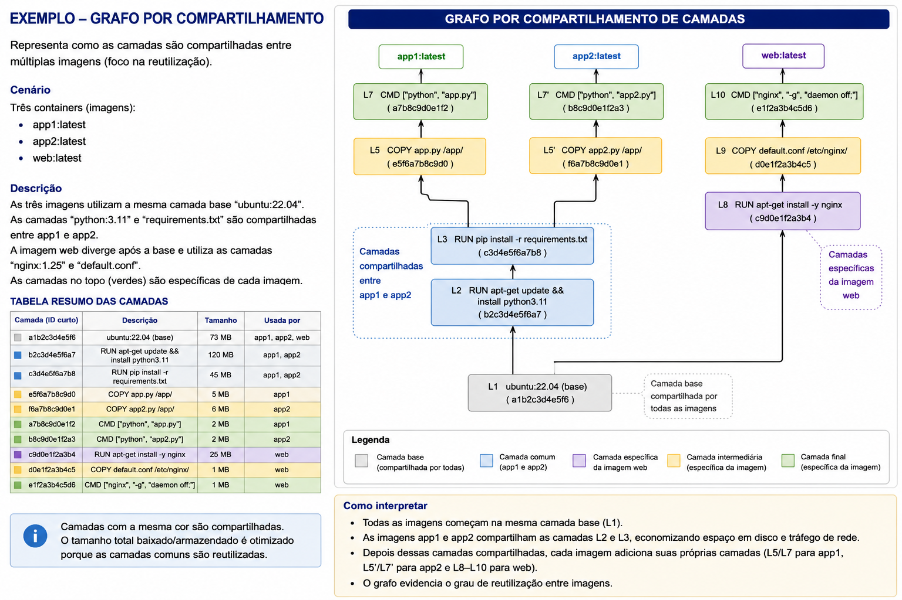
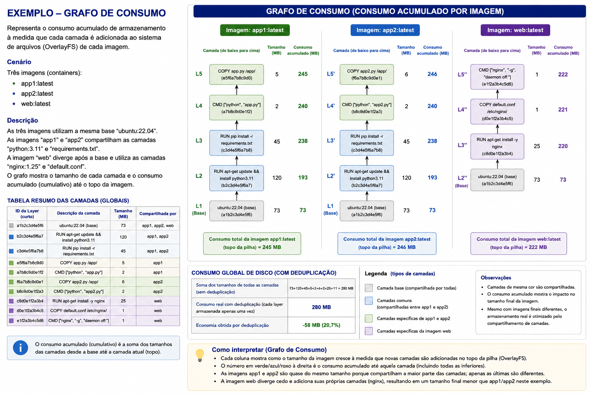

# Projeto — Análise de Camadas de Imagens Docker Utilizando OverlayFS

## Tema do Projeto

Construção de uma ferramenta capaz de analisar imagens de containers e representar visualmente a estrutura de camadas utilizada pelo sistema de arquivos OverlayFS (OnionFS).

## Objetivo do Projeto

O objetivo deste projeto é desenvolver uma aplicação capaz de analisar imagens Docker e identificar as camadas (layers) utilizadas na construção do sistema de arquivos em camadas empregado pelos containers modernos.

A aplicação deverá interpretar a estrutura das imagens, identificar suas dependências e construir um grafo e/ou tabela representando a relação entre as camadas compartilhadas entre diferentes imagens.

O projeto busca explorar conceitos fundamentais relacionados a:

* OverlayFS/UnionFS;
* sistemas de arquivos em camadas;
* armazenamento de imagens Docker;
* deduplicação de camadas;
* reutilização de layers;
* funcionamento interno de runtimes de containers.

Além da análise estrutural, os alunos poderão implementar mecanismos de catalogação e persistência utilizando SQLite, permitindo registrar:

* imagens analisadas;
* identificadores das camadas;
* relações entre imagens e layers;
* tamanho das camadas;
* compartilhamento entre imagens;
* histórico de análises.

O projeto tem como finalidade proporcionar uma compreensão aprofundada sobre como imagens de containers são armazenadas, compartilhadas e reutilizadas por ferramentas como **Docker**, **containerd** e **Podman**.

## Competências Esperadas

Ao final do projeto, espera-se que os alunos sejam capazes de:

* compreender o funcionamento de sistemas de arquivos em camadas;
* analisar imagens Docker internamente;
* compreender o funcionamento do OverlayFS;
* interpretar metadados de imagens de containers;
* construir grafos representando dependências;
* identificar compartilhamento de camadas;
* manipular APIs e comandos do Docker;
* desenvolver ferramentas de inspeção e análise;
* armazenar informações estruturadas em banco de dados.

## Requisitos Mínimos

O projeto deverá obrigatoriamente:

1. Analisar imagens Docker locais;
2. Identificar as camadas utilizadas por cada imagem;
3. Construir um grafo e/ou tabela representando as relações entre layers;
4. Exibir compartilhamento de camadas entre imagens;
5. Permitir análise de múltiplas imagens;
6. Identificar imagem base e camadas derivadas;
7. Exibir informações básicas:
   * ID da layer;
   * tamanho;
   * ordem de aplicação;
8. Gerar saída visual ou textual do grafo;
9. Funcionar em ambiente Linux;
10. Possuir documentação de uso.

---

## Requisitos Opcionais (Bônus)

Os grupos poderão implementar funcionalidades extras, como:

* interface web;
* exportação do grafo em:
  * PNG;
  * SVG;
  * JSON;
  * Graphviz DOT;
* análise automática de vulnerabilidades;
* comparação entre imagens;
* detecção de layers duplicadas;
* análise de consumo de armazenamento;
* integração com Docker Registry;
* suporte a OCI Images;
* análise histórica;
* dashboard interativo;
* busca por layers compartilhadas;
* análise de performance de build.

## Sugestões Técnicas para Implementação

### Fontes de análise possíveis

Os alunos poderão utilizar:

```bash
CLI Docker

docker inspect
docker history
docker image ls
```

### Diretórios internos do Docker

Exemplo:

```bash
/var/lib/docker/overlay2/
```

## Sugestão de Fluxo da Aplicação

### 1. Seleção da imagem

O usuário informa:

```bash
./analisador nginx:latest
```

### 2. Extração de metadados

A aplicação deverá:

* identificar layers;
* obter hashes;
* identificar imagem pai;
* descobrir ordem das camadas.

### 3. Construção do grafo

Cada layer poderá ser representada como:

* nó;
* conexão pai-filho.

Exemplo simplificado:

```bash
ubuntu-base
   ├── python-layer
   │      └── app-layer
   └── nginx-layer
```

### 4. Identificação de compartilhamento

O sistema deverá detectar:

* layers reutilizadas;
* imagens derivadas;
* otimização de armazenamento.

#### 5. Persistência (Opcional)

SQLite poderá armazenar:

* imagens;
* layers;
* relacionamentos;
* datas de análise.

Sugestão de Estrutura do Projeto

```text
project/
├── analyzer/
├── graph/
├── database/
├── exports/
├── images/
├── main.py
├── container.db
└── README.md
```

---

# Possíveis Estratégias de Construção do Grafo

## Grafo por dependência

Representa:

* Qual layer depende de qual.
  

## Grafo por compartilhamento

Representa:

* Quais imagens compartilham layers.
  

## Grafo por consumo

Representa:

* tamanho acumulado;
* impacto de armazenamento.
  

# Sugestões de Análises Interessantes

Os alunos poderão investigar:

* por que imagens pequenas reutilizam muitas layers;
* impacto de comandos Dockerfile nas layers;
* diferença entre:
  * `RUN`;
  * `COPY`;
  * `ADD`;
* crescimento do tamanho da imagem;
* reutilização entre imagens distintas.

---

# Modelo de Avaliação

## Critérios de Avaliação


| Critério                     | Peso |
| ------------------------------- | ------ |
| Funcionamento da análise     | 25%  |
| Construção correta do grafo | 20%  |
| Compreensão do OverlayFS     | 20%  |
| Qualidade da visualização   | 10%  |
| Organização do código      | 10%  |
| Documentação                | 10%  |
| Funcionalidades extras        | 5%   |

---

# Forma de Entrega

## Entrega obrigatória

Cada grupo deverá entregar:

### 1. Código-fonte

Disponibilizado em repositório Git.

### 2. README.md contendo

* objetivo do projeto;
* arquitetura da solução;
* instruções de execução;
* dependências;
* exemplos de análise;
* limitações conhecidas.
  Além disso:
* dificuldades encontradas;
* aprendizados obtidos.

### 3. Vídeo demonstrativo

Entre 5 e 15 minutos contendo:

* demonstração prática;
* análise de imagens;
* construção do grafo;
* interpretação dos resultados.

# Sugestões de Expansão do Projeto (Opcional)

Os grupos mais avançados poderão evoluir o projeto para:

* análise compatível com OCI;
* construção de um visualizador web semelhante ao Docker Desktop;
* integração com registries remotos;
* análise automática de segurança;
* otimização automática de Dockerfiles;
* análise de cache de build;
* comparação temporal entre versões de imagens.

Isso permitirá compreender internamente como plataformas modernas de containers gerenciam armazenamento, reutilização e distribuição de imagens.
